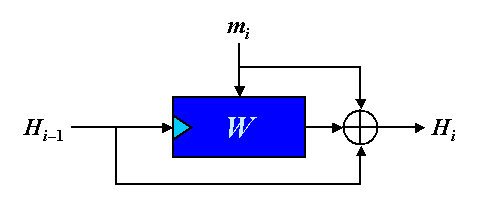

# WhirlpoolSwift

[](https://github.com/mingchen/WhirlpoolSwift/actions/workflows/CI.yml)
[](https://swiftpackageindex.com/mingchen/WhirlpoolSwift)
 [](https://swiftpackageindex.com/mingchen/WhirlpoolSwift)


The WHIRLPOOL hash function implemented in Swift. This Swift wrapper encapsulates the WHIRLPOOL reference implementation.

WHIRLPOOL is a hash function designed by Vincent Rijmen and Paulo S. L. M. Barreto that operates on messages less than 2256 bits in length, and produces a message digest of 512 bits.

WHIRLPOOL was adopted by the International Organization for Standardization (ISO) in the ISO/IEC 10118-3:2004 standard.

## Usage

Import this package through Swift Package Manager.

### Code Examples

```swift
import WhirlpoolSwift

let data1: Data = ...
let data2: Data = ...

var whirlpool = Whirlpool()
whirlpool.update(data: data1)
whirlpool.update(data: data2)
let digest = whirlpool.finalize()   // 64 bytes digest
```

Alternatively, for minimal data, in a single line.

```swift
import WhirlpoolSwift

let digest = Whirlpool.hash(data: input.data(using: .utf8)!)    // 64 bytes digest
```


## The function

WHIRLPOOL uses Merkle-Damgård strengthening and the Miyaguchi-Preneel hashing scheme with a dedicated 512-bit block cipher called W. This consists of the following. The bit string to be hashed is padded with a &lquo;'1'-bit, then with a sequence of '0'-bits, and finally with the original length (in the form of a 256-bit integer value), so that the length after padding is a multiple of 512 bits. The resulting message string is divided into a sequence of 512-bit blocks m1, m2, ... mt which is then used to generate a sequence of intermediate hash values H0, H1, H2, ... Ht. By definition, H0 is a string of 512 '0'-bits. To compute Hi, W encrypts mi using Hi-1 as key, and XORs the resulting ciphertext with both Hi-1 and mi. Finally, the WHIRLPOOL message digest is Ht.



## The Name

The WHIRLPOOL hashing function is named after the Whirlpool galaxy in Canes Venatici (M51, or NGC 5194), the first one recognized to have spiral structure by William Parsons, third Earl of Rosse, in April 1845 (cf. M. Hoskin, "The Cambridge Illustrated History of Astronomy," Cambridge University Press, 1997).

## References

- https://web.archive.org/web/20171129084214/http://www.larc.usp.br/~pbarreto/WhirlpoolPage.html
